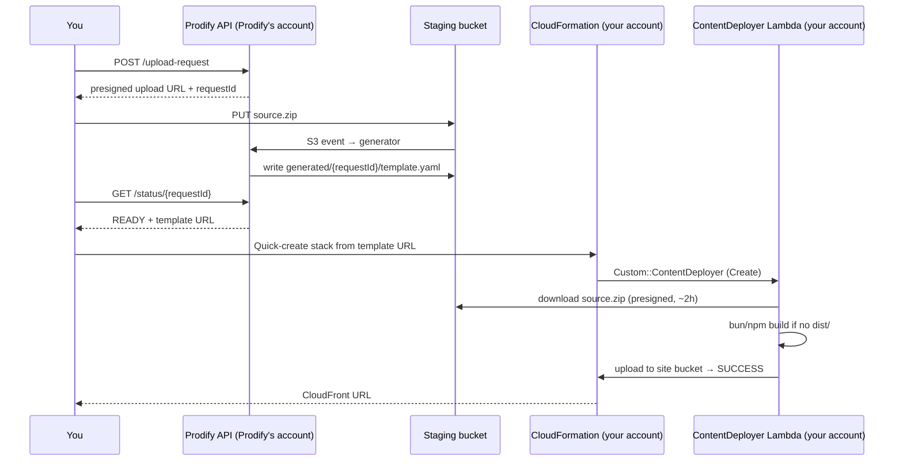

# Prodify

[](LICENSE)

Turn a [Lovable](https://lovable.dev) project export into a CloudFormation stack that hosts the site on S3 + CloudFront in **your own AWS account**. Upload the zip, get a one-click "Deploy to AWS" link.

Hosted version: **https://refaktr.io/prodify/**

## How it works



Two accounts are involved on purpose. Prodify's account only ever *reads* your zip to write a template; it never runs your code. The build (`bun install && bun run build`) happens inside a Lambda function that the generated stack creates in **your** account, using a container image Prodify publishes.

## What you get

The generated stack creates:

- A private S3 bucket (Block Public Access on, SSE-S3) holding the built site
- A CloudFront distribution with Origin Access Control, HTTPS redirect, HTTP/2+3, compression, the managed security-headers policy, and SPA routing (403/404 → `index.html`)
- A `ContentDeployer` Lambda (container image, arm64) that downloads, builds, and syncs the site, sets `Cache-Control` (`no-cache` for HTML, `immutable` for `assets/*`), and invalidates CloudFront on updates
- Optional custom domain: pass `DomainName` and `AcmCertificateArn` (certificate must be in `us-east-1`), then point a CNAME or Route 53 alias at the `CloudFrontDomainName` output

A complete generated template, with commentary, is in [examples/marios-nostalgia-bites/](examples/marios-nostalgia-bites/) — it's what Prodify produced for the reference project.

Stack lifecycle behaves the way you'd expect: **delete** empties the bucket first so the stack removes cleanly; **update** is a no-op unless the source URL changed, and a rollback to the previously deployed source never re-downloads.

## Compatibility and limits

| Works | Doesn't (yet) |
|---|---|
| Static Vite/React single-page apps (Lovable's classic template) | Anything that needs a server at runtime: server functions, SSR-only loaders, API routes |
| TanStack Start projects (Lovable's current template) — prerendered automatically, see below | Anything needing a backend: Lovable Cloud / Supabase auth, database, storage, edge functions keep pointing at their current host |
| `bun.lock`/`bun.lockb` (bun) or `package-lock.json` (npm); zips that already contain `dist/`, `build/`, or `.output/public/` | Uploads over 50 MB — leave out `node_modules` and build output |

**TanStack Start (Lovable's current template):** by default `vite build` targets Cloudflare Workers and produces a server bundle, so there's nothing static to host. The deployer handles this for you: when it sees `@tanstack/react-start` in `package.json`, it enables prerendering in its *build copy* of `vite.config.ts` (your repository is never modified), so the build also writes a complete static site to `.output/public/`. Every route is rendered at build time. If you'd rather make it explicit in your project, the equivalent setting is:

```ts
export default defineConfig({
  tanstackStart: {
    server: { entry: "server" },
    prerender: { enabled: true, crawlLinks: true, autoStaticPathsDiscovery: true },
  },
});
```

Other constraints:

- The generated template's source link is valid for about **two hours**. Deploy soon after generating; to deploy later, upload again.
- Stacks can be created in any region where the deployer image is replicated (`DeployerImageRegions`; the `/status` response lists them as `supportedRegions`, and the template's `Rules` block rejects others).
- **Brand-new AWS accounts may not be allowed to create CloudFront distributions yet.** If the stack fails at `CloudFrontDistribution` with "Your account must be verified before you can add new CloudFront resources", open an AWS Support case (Account and billing → account verification) quoting that message; it's typically cleared within a day. Delete the rolled-back stack and deploy again afterwards.
- **Accounts created with AWS's new sign-up experience are locked to one region** (us-east-2, eu-north-1, or ap-southeast-2, chosen from your contact address) and cannot create stacks in us-east-1 — the console shows an SCP "explicit deny". Open the deploy link with `region=` set to your project's region; all three are supported. Custom domains need an ACM certificate in us-east-1, which those accounts can't create, so use the CloudFront URL there.
- The hosted API is unauthenticated and rate-limited; use it for real projects, not load tests.

## Deploy your own instance

You need the AWS CLI, Docker (with buildx), and an AWS account.

```bash
# 1. Bucket for Lambda deployment packages
aws s3 mb s3://<deployment-bucket>
aws s3api put-bucket-tagging --bucket <deployment-bucket> --tagging 'TagSet=[{Key=Project,Value=Prodify}]'

# 2. Build and push the deployer image; prints the digest to pin
AWS_PROFILE=<profile> backend/docker/content-deployer/build-and-push.sh
#    Optional: make it available in more regions first
AWS_PROFILE=<profile> backend/docker/content-deployer/replicate-image.sh us-west-2 eu-west-1

# 3. Package the API Lambdas
cd backend/src && zip -r /tmp/lambda-code.zip *.py templates/ && cd ../..
aws s3 cp /tmp/lambda-code.zip s3://<deployment-bucket>/lambda-code-$(git rev-parse --short HEAD).zip

# 4. Deploy the backend
aws cloudformation deploy \
  --template-file backend/infrastructure/template.yaml \
  --stack-name prodify-backend \
  --parameter-overrides \
    DeploymentPackageBucket=<deployment-bucket> \
    LambdaCodeKey=lambda-code-$(git rev-parse --short HEAD).zip \
    DeployerImageDigest=<digest from step 2> \
    DeployerImageRegions=us-east-1,us-west-2,eu-west-1 \
    AlarmEmail=you@example.com \
  --tags Project=Prodify \
  --capabilities CAPABILITY_IAM
```

Stack tags propagate to every taggable resource, and `Project` is meant to be activated as a cost allocation tag (`aws ce update-cost-allocation-tags-status --cost-allocation-tags-status TagKey=Project,Status=Active`) so Prodify's cost shows up as its own line in Cost Explorer. The scripts tag the ECR repositories the same way.

The `ApiUrl` output is what a frontend calls (`POST /upload-request`, `GET /status/{requestId}`). Confirm the SNS subscription email to receive alarms. The staging bucket name is auto-generated unless you pass `StagingBucketName`.

**Continuous deployment:** deploy `backend/infrastructure/github-oidc.yaml` once (`--capabilities CAPABILITY_NAMED_IAM --tags Project=Prodify`), set its `DeployRoleArn` output as the `AWS_DEPLOY_ROLE_ARN` repository variable, and pushes to `main` deploy via [deploy.yml](.github/workflows/deploy.yml). Optional variables: `AWS_REGION`, `DEPLOYMENT_BUCKET`, `STACK_NAME`, `STAGING_BUCKET_NAME`, `ALARM_EMAIL`, `DEPLOYER_IMAGE_REGIONS`.

## Development

```bash
pip install -r requirements-dev.txt
cfn-lint backend/infrastructure/*.yaml
pytest                                   # unit tests + cfn-lint of a rendered site template
AWS_PROFILE=<profile> tests/docker/run-local.sh   # builds the deployer image and runs Create/Update/Delete against a throwaway bucket
```

Layout:

```
backend/infrastructure/template.yaml   Prodify backend (API Gateway, 3 Lambdas, staging bucket, alarms)
backend/infrastructure/github-oidc.yaml GitHub Actions deploy role
backend/src/                           upload_request.py, status.py, generator.py + templates/site-template.yaml
backend/docker/content-deployer/       the Lambda container image that runs in users' accounts
tests/                                 pytest suite, synthetic fixtures, Docker end-to-end runner
```

## Working with AI coding agents

This repo is set up for the [Agent Toolkit for AWS](https://github.com/aws/agent-toolkit-for-aws), which gives coding agents AWS skills plus the AWS MCP Server (sandboxed AWS API access and documentation search).

**One-time machine setup** (installs the AWS CLI, signs in via browser, configures the toolkit — no access keys needed). Paste this into your agent:

```text
Set up Agent Toolkit for AWS by following instructions:
https://raw.githubusercontent.com/aws/agent-toolkit-for-aws/refs/heads/main/setup-instructions/setup.md
```

**Per-agent notes**

- **Claude Code** — `.claude/settings.json` registers the toolkit marketplace and enables the `aws-core` plugin. Run `claude plugin install aws-core@agent-toolkit-for-aws` once; the AWS rules in `CLAUDE.md` load automatically.
- **Codex** — `codex plugin marketplace add aws/agent-toolkit-for-aws`, then `/plugins` → install `aws-core`.
- **Cursor** — Settings → Plugins → Team Marketplaces → Import from Repo → `aws/agent-toolkit-for-aws`, then install `aws-core`.

## Security

See [SECURITY.md](SECURITY.md) for the disclosure process and a description of what is public by design.

## License

Apache-2.0 — see [LICENSE](LICENSE). © 2025 Refaktr LLC.
